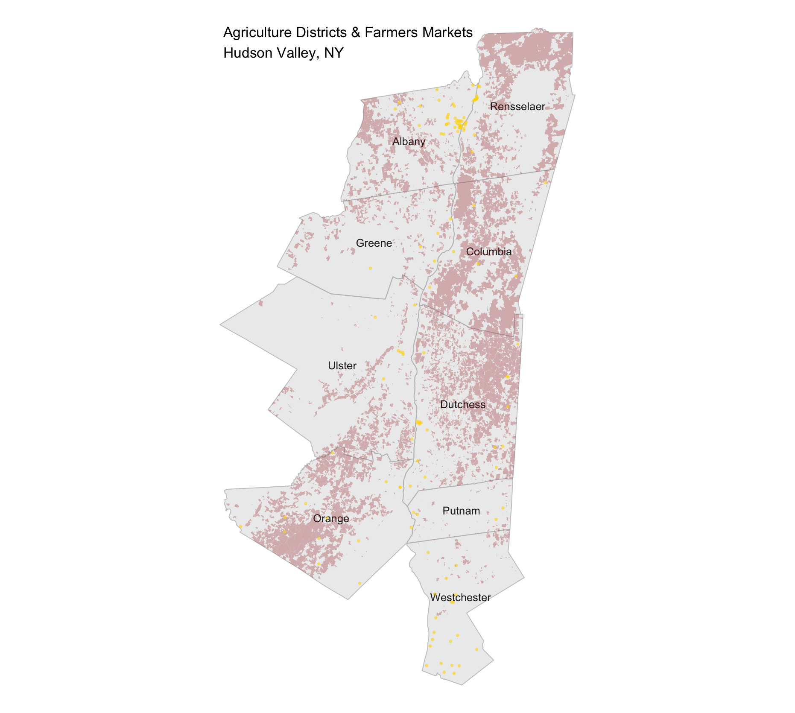
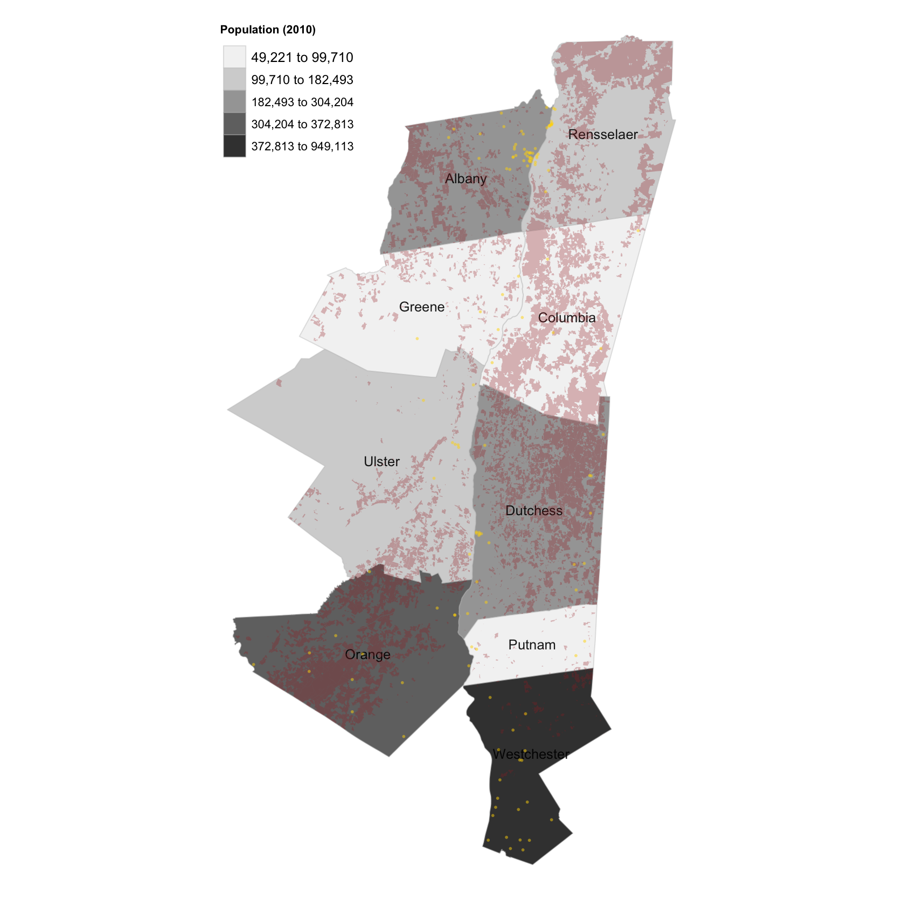
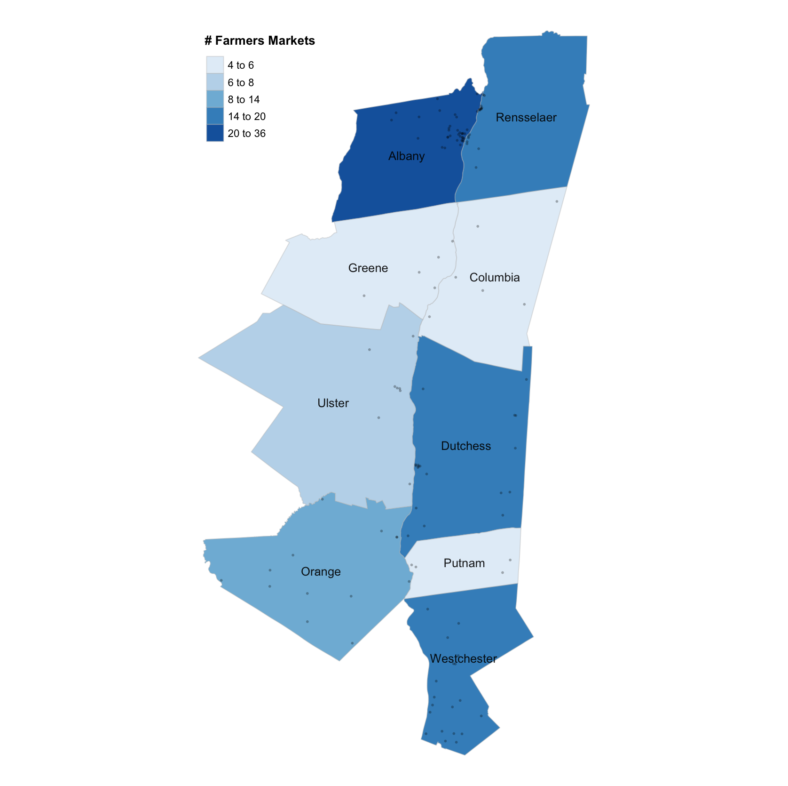
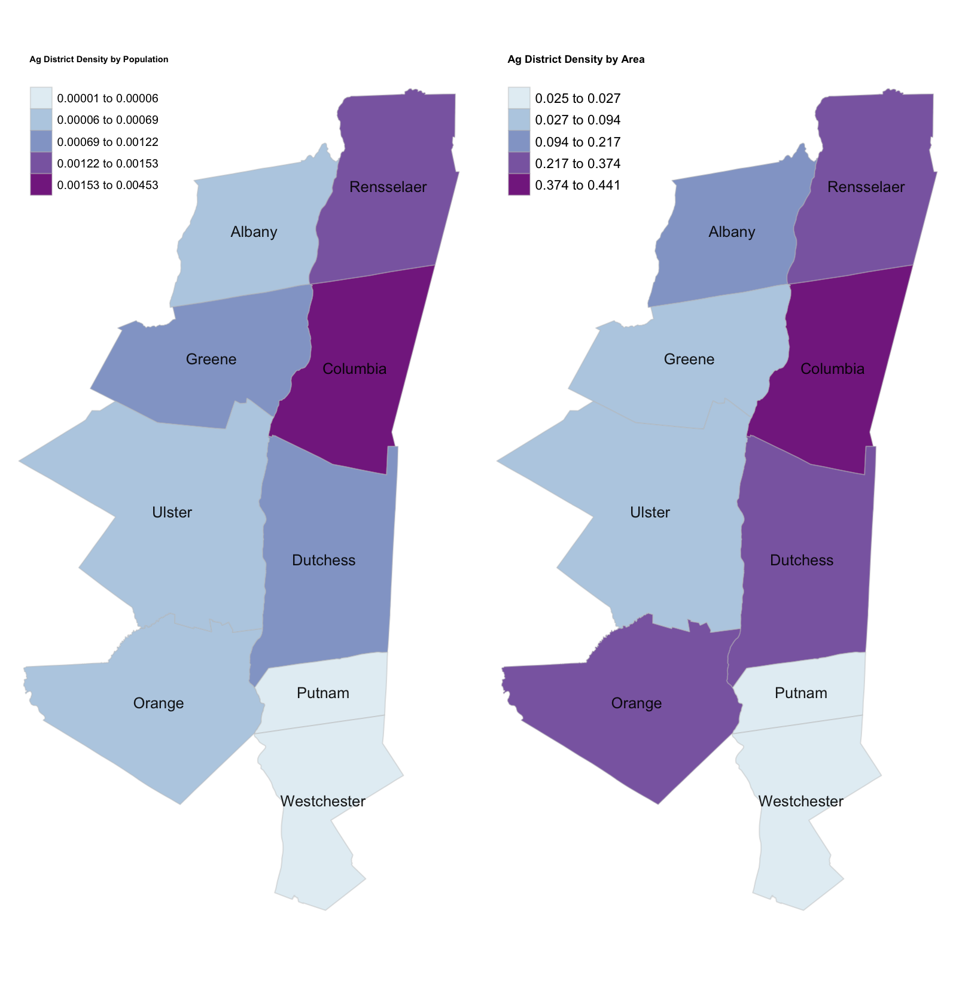

```{r libraries, include = FALSE }

library(tmap)
library(tidyverse)
library(sf)
library(sp)
library(rgdal)
library(rgeos)
library(raster)
library(stargazer)

```

```{r script, include = FALSE}

setwd("~/Desktop/Fall 2019/Spatial Data Science/Assignment 1")

# load NYS County boundary data
# SOURCE: NYS http://gis.ny.gov/gisdata/inventories/details.cfm?DSID=927

counties <- readOGR("NYS_Civil_Boundaries_SHP/Counties.shp")

counties <- st_as_sf(counties)

hv_counties <- counties %>% filter(NAME %in% c("Albany", "Greene",
                                                       "Ulster", "Orange", "Westchester",
                                                       "Putnam", "Dutchess",
                                                       "Columbia", "Rensselaer"))

# load NYS Ag District data
# SOURCE: https://cugir.library.cornell.edu/catalog/cugir-009010

ag_districts <- readOGR("NYS Ag Districts/nyAg2019.shp")
ag_districts <- st_as_sf(ag_districts)

hv_ag_districts <- ag_districts %>% filter(County %in% c("Albany", "Greene",
                                                         "Ulster", "Orange", "Westchester",
                                                         "Putnam", "Dutchess",
                                                         "Columbia", "Rensselaer"))

# transform projections
hv_counties <- st_transform(hv_counties, 32115) #32115 is projection for NY East https://epsg.io/32115
st_crs(hv_counties)

hv_ag_districts <- st_transform(hv_ag_districts, 32115)
st_crs(hv_ag_districts)

# Add variable calculating Area (sq meters)
hv_ag_districts$Area_sqm <- st_area(hv_ag_districts) %>%
  as.numeric(as.character(hv_ag_districts$Area))

# Area - square miles
hv_ag_districts$Area_sqmi <- hv_ag_districts$Area_sqm / 2590000

# Area - acres
hv_ag_districts$Area_acres <- hv_ag_districts$Area_sqmi * 640

# load NYS Farmers Markets data
# SOURCE: https://data.ny.gov/Economic-Development/Farmers-Markets-in-New-York-State/qq4h-8p86/data

markets <- read.csv("Farmers__Markets_in_New_York_State.csv")

# convert to spatial points
market_points <- st_as_sf(markets,
                          coords = c("Longitude", "Latitude"),
                          crs = 32115,
                          agr = "constant")

hv_markets <- market_points %>% filter(County %in% c("Albany", "Greene",
                                                     "Ulster", "Orange", "Westchester",
                                                     "Putnam", "Dutchess",
                                                     "Columbia", "Rensselaer"))


#########################################
##### Point in Polygon calculations #####
#########################################

# MARKETS PiP
# join markets to counties
markets_in_county <- st_join(hv_markets, hv_counties, join = st_within) %>% 
  mutate(NAME = coalesce(County))

# count markets per county
markets_count <- count(as_tibble(markets_in_county), NAME) %>% print()

# AG DISTRICTS PiP
# join ag districts to counties
ag_districts_in_county <- st_join(hv_ag_districts, hv_counties, join = st_within) %>%
  mutate(NAME = coalesce(County))

# count ag districts per county
ag_districts_count <- count(as_tibble(ag_districts_in_county), NAME) %>% print()

# count ag district AREAS (acres and sq mi) per county
ag_districts_area <- ag_districts_in_county %>% group_by(NAME) %>%
  summarize_at(c("Area_acres", "Area_sqmi"), sum, na.rm=TRUE)

st_geometry(ag_districts_area) <- NULL #remove geometry

# population dataset
hv_populations <- data_frame("NAME" = hv_counties$NAME,
                             "POP2010" = hv_counties$POP2010)

# merge data into one table
total_count <- merge(ag_districts_count, ag_districts_area, by = "NAME")
total_count <- merge(total_count, markets_count, by = "NAME")
total_count <- merge(total_count, hv_populations, by = "NAME")

colnames(total_count) <- c("Name", "# Districts", "Districts (Acres)", "Districts (SqMi)", "# Markets", "Population")

table1 <- stargazer(total_count, 
                    summary = FALSE, 
                    type = "text", 
                    font.size = "tiny",
                    title = "Table 1: County Totals")

# CHLOROPLETH MAP for AG DISTRICTS
# merge count data with county shapefile
counties_with_count <- merge(hv_counties, ag_districts_count, by = "NAME")
# rename "n" variable
colnames(counties_with_count)[colnames(counties_with_count) == "n"] <- "# Ag Districts"
# merge area data with county shapefile
counties_with_area <- merge(hv_counties, ag_districts_area, by = "NAME")
# rename "sum" variable
colnames(counties_with_area)[colnames(counties_with_area) == "Area_acres"] <- "Total Acres: Ag Districts"

###################
##### MAPPING #####
###################

# Change POP2010 variable to numeric
counties_with_count$POP2010 <- as.numeric(as.character(counties_with_count$POP2010))
# Change name
colnames(counties_with_count)[colnames(counties_with_count) == "POP2010"] <- "Population"

# Calculate Ag Districts density (sq mi) by population 
counties_with_count$Ag_Density_Pop <- counties_with_area$Area_sqmi / counties_with_count$`Population`
# Change name
colnames(counties_with_count)[colnames(counties_with_count) == "Ag_Density_Pop"] <- "Ag District Density by Population"

# Calculate Ag Districts density(sq mi) by county area
counties_with_count$Ag_Area_Density <- counties_with_area$Area_sqmi / counties_with_count$CALC_SqMi
# Change name
colnames(counties_with_count)[colnames(counties_with_count) == "Ag_Area_Density"] <- "Ag District Density by Area"

# Calculate Ag District (acres) density by population
#counties_with_count$Ag_Pop_Density <- counties_with_area$`Total Acres: Ag Districts` / counties_with_count$`Population (2010)`

# MAP Points map of Ag Districts and Markets

figure_1 <- 
  tm_shape(hv_counties) +
  tm_borders(col = 'gray', alpha = .8) +
  tm_fill(col = 'gray', alpha = .3) +
  tm_text(text = "NAME",
          size = 0.8,
          col = 'black',
          fontface = 1,
          alpha = .9) +
  tm_shape(hv_ag_districts) +
  tm_fill(col = 'brown', alpha = .3) +
  tm_shape(hv_markets) +
  tm_dots(col = "gold", alpha = .6, size = .07) +
  tm_layout(frame = FALSE, 
            legend.show = TRUE)

# MAP District and Market points onto Population chloropleth 

figure_2 <- 
  tm_shape(counties_with_count) +
  tm_borders(col = 'gray', alpha = .4) +
  tm_fill(col = "Population", style = "jenks", palette = "Greys") +
  tm_text(text = "NAME",
          size = 0.8,
          col = 'black',
          fontface = 1,
          alpha = .9) +
  tm_shape(hv_ag_districts) +
  tm_fill(col = "brown", alpha = .3) +
  tm_shape(hv_markets) +
  tm_dots(col = "gold", alpha = .5, size = .04) +
  tm_layout(legend.show = TRUE,
            legend.title.size = .8,
            legend.position = c("LEFT", "TOP"),
            legend.text.size = 0.8,
            legend.title.fontface = 2,
            frame = FALSE)

# CHLOROPLETH MAP for FARMERS MARKETS 

# merge count data with county shapefile
counties_with_count <- merge(counties_with_count, markets_count, by = "NAME")

# rename "n" variable
colnames(counties_with_count)[colnames(counties_with_count) == "n"] <- "# Farmers Markets"

# MAP Number of Farmers Markets by County
figure_3 <- 
  tm_shape(counties_with_count) +
  tm_borders(col = 'gray', alpha = .4) +
  tm_fill(col = "# Farmers Markets", style = "jenks", palette = "Blues") +
  tm_text(text = "NAME",
          size = 0.8,
          col = 'black',
          fontface = 1,
          alpha = 0.9) +
  tm_shape(hv_markets) +
  tm_dots(col = "black", alpha = .3, size = .04) +
  tm_layout(legend.show = TRUE,
            legend.title.size = 1,
            legend.title.fontface = 2,
            frame = FALSE)


# MAP Ag Acreage Density by Population

districts_pop <- 
  tm_shape(counties_with_count) +
  tm_borders(col = 'gray', alpha = .4) +
  tm_fill(col = "Ag District Density by Population", style = "jenks", palette = "BuPu") +
  tm_text(text = "NAME",
          size = 0.8,
          col = 'black',
          fontface = 1,
          alpha = 0.9) +
  tm_layout(legend.title.size = 1.5,
            legend.title.fontface = 2,
            frame = FALSE)

districts_pop


# MAP Ag Acreage Density by Area
districts_area <- 
  tm_shape(counties_with_count) +
  tm_borders(col = 'gray', alpha = .4) +
  tm_fill(col = "Ag District Density by Area", style = "jenks", palette = "BuPu") +
  tm_text(text = "NAME",
          size = 0.8,
          col = 'black',
          fontface = 1,
          alpha = 0.9) +
  tm_layout(legend.title.size = 1.5,
            legend.title.fontface = 2,
            frame = FALSE)

districts_area

## Arrange side by side

figure_4 <- tmap_arrange(districts_pop, districts_area)


```

## Introduction
This data represents one dimension of the agricultural landscape in the Hudson Valley region in New York State. The Hudson Valley is comprised of 10 counties that border the Hudson River Valley, located in the southern part of the state. I used publicly available data on county boundaries, agricultural districts, farmers markets, and population in those counties to explore and identify possible trends in the production and consumption of fresh food. I performed this analysis and created the maps using R.

## Data Sources & Variables
I downloaded the New York Counties shapefile from the [NYS GIS Clearing House](http://gis.ny.gov/gisdata/inventories/details.cfm?DSID=927). In addition to the county boundaries, this shapefile contained other variables of interest for this assignment: population and total area. I filtered this dataset down to the Hudson Valley counties, selected the variables I needed and saved this new variable. The New York State Agricultural Districts dataset was a shapefile from the [Cornell University Geospatial Information Repository](https://cugir.library.cornell.edu/catalog/cugir-009010). This was a large dataset (36,926 observations) with spatial data for every agricultural district across the state. I filtered this dataset down to the Hudson Valley counties of interest for a total of 4,391 observations/districts, and saved this new variable. The Farmers’ Market dataset was from the [New York State Open Data Portal](https://data.ny.gov/Economic-Development/Farmers-Markets-in-New-York-State/qq4h-8p86/data). This dataset was in a non-spatial .csv format, but it contained Latitude and Longitude variables so I was able to read it into R as a spatial points dataset.  I also filtered this dataset down to the Hudson Valley counties of interest. 

## Mapping & Analysis
I transformed all the dataset projections into EPSG:32115 (New York East) to ensure they matched. Next, realizing that a simple count of the agricultural districts per county would not be a very meaningful comparison, I calculated the area of each agricultural district based on the Geometry of the spatial polygon. I used the *st_area()* function on the geography variable of the dataset to create a new variable of the area of each district in square meters (the standard measure of this projection) and converted it to square miles, as this is a more commonly used and understood area measurement in the United States.  

In order to calculate the rates of density, I created new variables - density by population and density by area - by dividing each county’s total area in square miles by its population and the total square miles of its agricultural districts. These are the variables I used for chloropleth maps comparing density (Figure 4). 

I performed point-in-polygon calculations in order to obtain counts of agricultural districts and farmers markets in the counties. This required a spatial join using *st_join()* on the the Ag Districts and County datasets, then Farmers Markets and County datasets, by their shared *NAME* variables, then aggregated the count of the number of districts and markets per county. I conducted the same P-i-P analysis to obtain the total population and acreage of agricultural districts per county, both of which were used in my chloropleth mapping and analysis. See **Table 1** for complete aggregated variables. \  
\  
\  
\  
\  
\  
\  
\  
\  
\  
\  
```{r table, echo=FALSE}

table1

```

**Figure 1** (all figures below) is a points map shows the Farmers Markets (yellow points) and Ag Districts (red polygons) across counties in the region. We can observe that ag districts covering a lot of land in Columbia, Dutchess, Rensselaer and Orange Counties, while the markets are clustered down in Westchester, along the Hudson River in the lower half of the region, and then up in eastern Albany County. The only county where there are both a high number of markets and relatively large amount of ag lands is Albany County. 

**Figure 2** is a points map overlaid on county population data. By overlaying the market points and district polygons onto the population chloropleth, we can start to observe how many people are interacting with markets and agricultural lands. Westchester has the highest population and a high number of farmers markets – it would make sense that demand would attract supply. However, Orange County has the next highest population and a much lower proportion of farmers markets. This points to other factors besides population size influencing the presence of farmers markets, such as socioeconomic or geographic differences between the counties. The fact that Westchester is one of the wealthiest counties in the country, combined with its close proximity to New York City, means there is likely a disproportionately high-demand market there. These questions could be explored in further analysis.  

**Figure 3** is a chloropleth map showing the number of farmers markets per county, using a Jenks natural break classification. To prepare this data for mapping, I merged the non-spatial markets count data with the county spatial data by the shared NAME variable. This map shows that the county with the most markets is Albany, while Putnam, Columbia and Greene are in the lowest bucket of only 4-6 markets. 

**Figure 4** shows two choropleth maps, also using natural breaks, illustrating the density of the agricultural districts compared with different measures: population and total area. Columbia County has the highest density in both of these categories, meaning it has both a large amount of agricultural lands in proportion to its population, as well as its total area. Putnam and Westchester both have the lowest densities. While Westchester has the highest population in the region, Putnam has one of the lowest, which indicates that Putnam County has the highest potential to add more agricultural districts – assuming that low-population areas are not already being used to other industries.

The magnitude and the range of density rates are also worth exploring further. The population density rate is much smaller than the area density rate by several orders of magnitude, which suggests that there is much more agricultural land per square mile than there is per person. This makes sense, since (of course) there is more than one person living per square mile. However, it also points to the ways in which this line of analysis could be further used in research or policy. For example, this comparison could be useful for exploring how productive agricultural lands can be expanded into more densely populated areas or identifying where land protection and conservation programs have been successful. 











